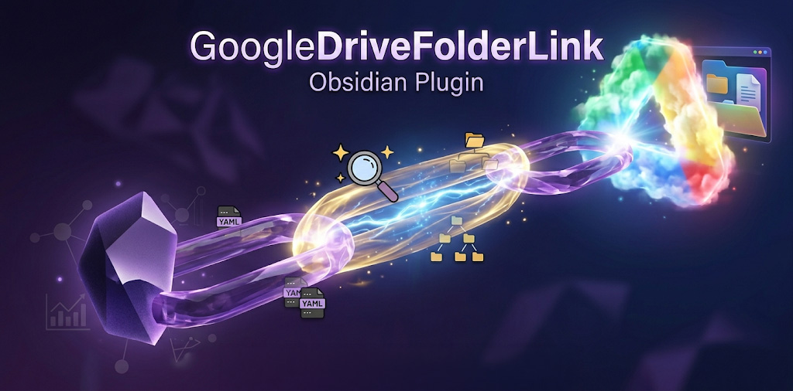

# Google Drive Folder Link

An Obsidian plugin that lets you attach a Google Drive folder to a note via fuzzy search. Search across configured root folders in My Drive and Shared Drives, and access linked folders with one click from the note's properties pane.



## Features

- Fuzzy search across Google Drive folders within configured root folders
- Supports both My Drive and Shared Drives
- Folder association stored in note frontmatter
- Clickable link in the Properties pane to open the folder in your browser
- Command palette and context menu integration

## Setup

### 1. Create Google Cloud OAuth Credentials

This plugin requires each user to create their own Google Cloud OAuth credentials.

1. Go to the [Google Cloud Console](https://console.cloud.google.com/)
2. Create a new project (or select an existing one)
3. Enable the **Google Drive API**:
   - Navigate to **APIs & Services > Library**
   - Search for "Google Drive API" and click **Enable**
4. Create OAuth 2.0 credentials:
   - Navigate to **APIs & Services > Credentials**
   - Click **Create Credentials > OAuth client ID**
   - If prompted, configure the OAuth consent screen first (External is fine for personal use)
   - Application type: **Desktop app**
   - Give it a name (e.g., "Obsidian Drive Link")
   - Click **Create**
5. Copy the **Client ID** and **Client Secret**

### 2. Configure the Plugin

1. Install and enable the plugin in Obsidian
2. Open **Settings > Google Drive Folder Link**
3. Paste your Client ID and Client Secret
4. Click **Connect** and authorize access in your browser
5. Add one or more root folders to search within using **Add root folder**

### 3. Usage

- **Attach a folder:** Open a note, then use the command palette ("Attach Google Drive folder...") or right-click the file and select "Attach Google Drive folder..."
- **Open an attached folder:** Click the link in the Properties pane, use the command palette ("Open attached Google Drive folder"), or right-click the file
- **Remove a link:** Delete the `googleDriveFolderId` and `googleDriveFolderName` properties from the note

## Development

```bash
npm install
npm run dev
```
